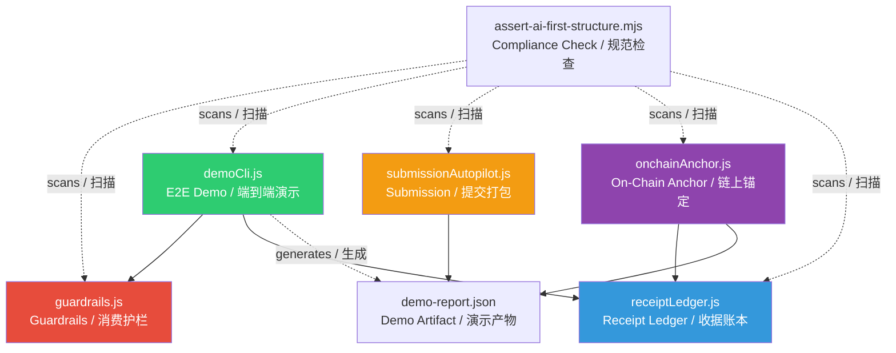

# System Architecture / 系统架构详解

> **Version / 版本**: v0.1 | **Updated / 更新日期**: 2026-03-19

---

## Design Philosophy / 设计理念

TrustStack's architecture is built on three core principles:

TrustStack 的架构基于三个核心原则：

1. **Policy-First / 策略先行** — Any action must pass policy checks before execution / 任何操作在执行前必须通过策略检查
2. **Immutable Audit / 不可变审计** — Every decision generates hash-linked receipts that cannot be tampered with / 每次决策都生成哈希链式收据，事后无法篡改
3. **Zero-Trust Execution / 零信任执行** — The system doesn't trust the Agent's intent, only the policy engine's judgment / 系统不信任 Agent 的意图，只信任策略引擎的判断

---

## End-to-End Data Flow / 端到端数据流

The diagram below shows the complete lifecycle of an Agent action request, from initiation to evidence recording:

下图展示一次 Agent 操作请求从发起到存证的完整生命周期：

```
                        ┌── Human-defined ──┐
                        │    SpendPolicy    │
                        │ ┌───────────────┐ │
                        │ │ perTxLimit:    │ │
                        │ │   100 USD     │ │
                        │ │ allowlist:    │ │
                        │ │  [wallet:ops] │ │
                        │ └───────────────┘ │
                        └────────┬──────────┘
                                 │
┌──────────────┐                 ▼                 ┌──────────────┐
│ Agent sends  │   ┌─────────────────────────┐     │ Receipt      │
│ SpendRequest │──▶│  evaluateSpendRequest() │──┬─▶│ Ledger       │
│ Agent 发起    │   │                         │  │  │ 收据账本      │
│ SpendRequest │   │  1. Validate policy     │  │  │              │
│              │   │     验证策略合法性        │  │  │ createReceipt│
│ requestId    │   │  2. Validate request    │  │  │ ()           │
│ amountUsd    │   │     验证请求合法性        │  │  │              │
│ recipient    │   │  3. Check limit         │  │  │ Input / 输入: │
└──────────────┘   │     检查限额            │  │  │  prevHash    │
                   │  4. Check allowlist     │  │  │  id, action  │
                   │     检查白名单           │  │  │  status      │
                   │  5. Return Decision     │  │  │  reason      │
                   │     返回 Decision       │  │  │              │
                   └─────────────────────────┘  │  │ Output / 输出:│
                             │                  │  │ ReceiptRecord │
                             ▼                  │  │ (with hash)  │
                   ┌─────────────────────────┐  │  └──────┬───────┘
                   │   GuardDecision         │  │         │
                   │                         │──┘         ▼
                   │ allowed: true/false     │    ┌──────────────┐
                   │ reason: ALLOWED /       │    │ Hash Chain   │
                   │   BLOCKED_LIMIT /       │    │ 哈希链        │
                   │   BLOCKED_RECIPIENT /   │    │              │
                   │   BLOCKED_MULTIPLE      │    │ GENESIS      │
                   │ violations: [...]       │    │   ↓          │
                   └─────────────────────────┘    │ Receipt #1   │
                                                  │ hash: a3f... │
                                                  │   ↓          │
                                                  │ Receipt #2   │
                                                  │ prevHash:    │
                                                  │   a3f...     │
                                                  │ hash: 7b2... │
                                                  └──────────────┘
```

---

## Module Dependencies / 模块依赖关系



### Module Responsibility Boundaries / 模块职责边界

| Module / 模块 | Package / 包位置 | Responsibility / 职责 | Statefulness / 状态性 |
|------|--------|------|--------|
| `guardrails.js` | `apps/agent-core` | Policy evaluation / 策略评估 | **Stateless / 无状态** — Pure functions / 纯函数 |
| `receiptLedger.js` | `packages/receipt-sdk` | Receipt creation & chain verification / 收据创建与链校验 | **Stateless / 无状态** — Caller manages storage / 调用方管理存储 |
| `demoCli.js` | `apps/agent-core` | Orchestrate demo flow / 编排演示流程 | Has side effects — writes to filesystem / 有副作用 — 写入文件 |
| `submissionAutopilot.js` | `apps/agent-core` | Generate submission bundle / 生成提交包 | Has side effects — reads & writes filesystem / 有副作用 — 读写文件 |
| `onchainAnchor.js` | `apps/agent-core` | Anchor root and verify tx payload / root 锚定与交易载荷验证 | Has side effects — JSON-RPC network calls / 有副作用 — JSON-RPC 网络调用 |

---

## Core Data Structures / 核心数据结构

### SpendPolicy / 消费策略

```javascript
{
  perTxLimitUsd: 100,           // Per-transaction limit (USD) / 单笔交易上限
  recipientAllowlist: [         // Approved recipients / 允许的收件人白名单
    'wallet:ops',
    'service:compute'
  ]
}
```

Defined by humans, unmodifiable by Agents. The policy is the trust anchor of TrustStack.

由人类预设，Agent 无法修改。策略是 TrustStack 信任模型的锚点。

### SpendRequest / 消费请求

```javascript
{
  requestId: 'req-allow-001',   // Unique request ID for tracing / 唯一请求 ID，用于追踪
  amountUsd: 75,                // Requested amount (USD) / 请求金额
  recipient: 'wallet:ops'       // Recipient identifier / 收件人标识
}
```

Initiated by Agent, must be evaluated by Guardrails before execution.

由 Agent 发起，必须经过 Guardrails 评估后才能执行。

### GuardDecision / 护栏决策

```javascript
{
  allowed: true,                // Whether allowed / 是否允许
  reason: 'ALLOWED',           // Reason code / 原因代码
  violations: []               // Violation details / 违规详情列表
}
```

**Reason Enum / 原因枚举**:
| Value / 值 | Meaning / 含义 |
|---|---|
| `ALLOWED` | Passed all checks / 通过所有检查 |
| `BLOCKED_LIMIT` | Amount exceeds perTxLimitUsd / 金额超过限额 |
| `BLOCKED_RECIPIENT` | Recipient not in allowlist / 收件人不在白名单 |
| `BLOCKED_MULTIPLE` | Both limit and allowlist violated / 同时违反限额和白名单 |

### ReceiptRecord / 收据记录

```javascript
{
  id: 'req-allow-001',          // Associated request ID / 关联的请求 ID
  ts: '2026-03-14T14:42:15Z',  // ISO timestamp / ISO 时间戳
  action: 'spend',             // Action type / 操作类型
  status: 'executed',          // Execution status / 执行状态
  reason: 'ALLOWED',           // Decision reason / 决策原因
  prevHash: 'GENESIS',         // Previous receipt hash (first = GENESIS) / 前一条收据的哈希
  hash: 'd350225fa07...'       // Current receipt SHA-256 hash / 当前收据的 SHA-256 哈希
}
```

**Status Enum / 状态枚举**:
| Value / 值 | Meaning / 含义 |
|---|---|
| `allowed` | Guardrail approved (pre-execution) / 护栏批准（预执行阶段） |
| `blocked` | Guardrail denied or execution prevented / 护栏拒绝或执行被阻止 |
| `executed` | Action successfully executed / 操作已成功执行 |

---

## Hash Chain Integrity Mechanism / 哈希链完整性机制

### How Hashes Are Computed / 哈希计算方式

Each receipt's hash is computed by **Stable Stringify** (alphabetically-sorted keys, recursive) followed by SHA-256:

每条收据的 hash 由 **稳定序列化 (Stable Stringify)**（递归按字母序排列 key）后进行 SHA-256 计算得出：

```
hash = SHA-256(stableStringify({ id, ts, action, status, reason, prevHash }))
```

### Chain Structure / 链式结构

```
Receipt #0                    Receipt #1                    Receipt #2
┌─────────────────────┐      ┌─────────────────────┐      ┌─────────────────────┐
│ prevHash: "GENESIS" │      │ prevHash: a3f2e...  │      │ prevHash: 7b21c...  │
│ hash: a3f2e...      │─────▶│ hash: 7b21c...      │─────▶│ hash: 92d4f...      │
└─────────────────────┘      └─────────────────────┘      └─────────────────────┘
```

### Tamper Detection / 篡改检测

`verifyChain()` validates chain integrity through these steps / 通过以下步骤验证链完整性：

1. Check first receipt's `prevHash` is `"GENESIS"` / 检查首条收据的 `prevHash` 是否为 `"GENESIS"`
2. For each receipt, recompute the hash / 遍历每条收据，重新计算哈希
3. Compare `prevHash` against previous receipt's `hash` / 比对 `prevHash` 是否指向前一条的 `hash`
4. Compare stored `hash` against recomputed value / 比对存储的 `hash` 是否与重新计算的一致
5. Any mismatch returns `{ ok: false, firstBrokenIndex: i }` / 任何不一致立即返回异常索引

---

## Security Boundaries / 安全边界

### Trust Model / 信任模型

```
            Trust Boundary / 信任边界
         ┌────────────────────────┐
Human ──▶│  Policy Definition     │ ← Trusted (human-defined / 人类设定)
         │  策略定义               │
         └────────────────────────┘
              │
              ▼
         ┌────────────────────────┐
Agent ──▶│  Guardrails Check      │ ← Trusted (code-enforced / 代码强制)
         │  护栏检查               │
         └────────────────────────┘
              │
              ▼
         ┌────────────────────────┐
         │  Receipt Ledger        │ ← Verifiable (hash-chain / 哈希链保证)
         │  收据账本               │
         └────────────────────────┘
```

### Defense Mechanisms / 防御措施

| Layer / 层级 | Mechanism / 机制 |
|------|------|
| **Input Validation / 输入验证** | All public functions validate params; invalid inputs fail fast / 所有公开函数校验参数，无效输入快速失败 |
| **Policy Enforcement / 策略强制** | Guardrails block unauthorized actions before execution / 护栏在执行前阻止越权操作 |
| **Immutable Evidence / 不可变存证** | SHA-256 hash chain makes any tampering detectable / SHA-256 哈希链使任何篡改可被检测 |
| **Minimal Dependencies / 最小依赖** | Core logic uses Node built-ins; `ethers` is scoped to EVM tx signing / 核心逻辑使用内置模块，`ethers` 仅用于 EVM 交易签名 |

---

## Future Extension Points / 未来扩展点

### P2: Reputation Passport / 声誉护照
- Extract success/failure rates and patterns from receipt history / 从收据历史中提取成功/失败率和操作模式
- Compute explainable trust scores / 计算可解释的信誉分数
- Provide trust credentials for cross-system Agent identity / 为跨系统 Agent 身份提供信任凭证

### P3: On-Chain Anchoring (v1) / 链上锚定（v1）
- Compute root from local receipt chain (`computeReceiptRoot`) / 从本地收据链计算 root
- Encode root into EVM tx payload (`TRUSTSTACK_ROOT:` + 32-byte hex) / 将 root 编码进 EVM 交易载荷
- Verify anchored root by comparing on-chain payload with local report / 对比链上载荷与本地报告完成验证
